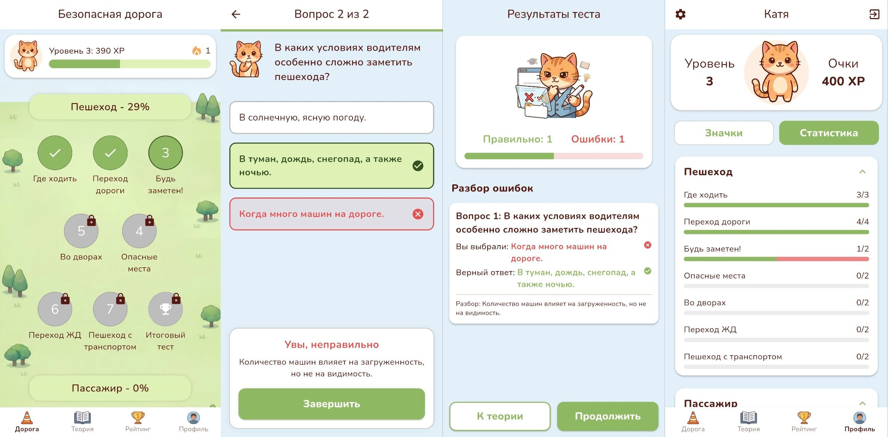
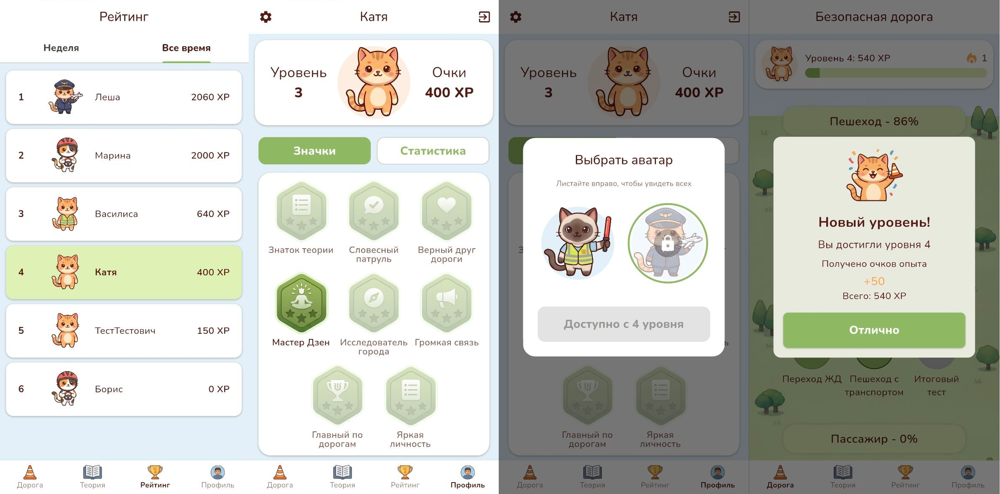

# SafeRoad (Безопасная дорога)

Мобильное приложение для обучения школьников правилам дорожного движения с использованием игровых механик.

## Описание проекта
Приложение разработано в рамках выпускной квалификационной работы. Основная цель — повышение вовлеченности школьников в изучение ПДД через микрообучение, систему достижений, уровней и рейтингов.

## Основные возможности
- Микрообучение: Короткие уроки с теорией и примерами.
- Тестирование: адаптивный подбор вопросов и мгновенная обратная связь
- Статистика успеваемости



- Геймификация: Начисление очков опыта (XP), система уровней, достижения и еженедельные рейтинги.




## Стек технологий
- Backend: Java 25, Spring Boot 4, PostgreSQL.
- Frontend: Flutter (Dart).
- API: RESTful API, SSE (Server-Sent Events).
- Безопасность: JWT (JSON Web Tokens), Spring Security.

## Структура проекта

Проект разделен на две основные части: серверную (`safe-road-backend`) и клиентскую (`safe-road-mobile`).

### Backend (Модульный монолит)
```
safe-road-backend/
├── app-main/               # Точка входа и глобальная конфигурация
├── core/                   # Общие DTO, исключения и утилиты
├── migrations/             # Миграции БД (Liquibase)
├── module-auth/            # Модуль авторизации и управления пользователями
├── module-content/         # Управление учебным контентом
├── module-gamification/    # Логика уровней, XP и достижений
├── module-learning/        # Адаптивное обучение и тесты
└── module-notifications/   # Система уведомлений
```

### Mobile (Flutter)
```
safe-road-mobile/
└── lib/
├── core/           # Общие конфигурации и константы
├── data/           # Слой данных
│   ├── models/     # Модели данных (DTO)
│   └── services/   # Сервисы для работы с API (Dio)
├── logic/          # Слой бизнес-логики
│   └── providers/  # Управление состоянием (Provider)
├── ui/             # Слой представления (UI)
│   ├── screens/    # Экраны приложения
│   ├── styles/     # Стили элементов
│   ├── theme/      # Тема приложения (цветовая палитра)
│   └── widgets/    # Переиспользуемые компоненты
├── utils/          # Вспомогательные утилиты
└── main.dart       # Точка входа в приложени
```

Интерактивная документация API доступна через **Swagger (OpenAPI)** по адресу
http://localhost:8080/swagger-ui/index.html при локальном запуске.
